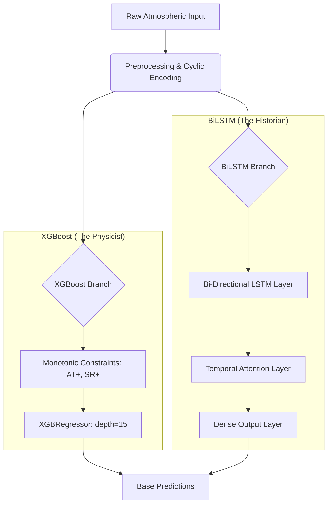

# Technical Analysis: Advanced Surface Ozone Multi-Model Forecasting
**Author:** Antigravity AI (Lead Architect) & User (Domain Expert)
**Date:** April 2026
**Scope:** Hourly Urban Ozone ($O_3$) Prediction in Delhi, India

---

## 1. Project Objective
The primary objective of this project is to construct a **Research-Grade Ensemble Forecasting System** capable of predicting ground-level ozone concentrations at a 1-hour resolution. The system specifically targets the mitigation of **"Peak Dampening"**—a common failure in ML where models fail to predict hazardous, extreme pollution events (>200 µg/m³) due to their statistical rarity.

---

## 2. The Development Pathway: A Granular History

### Phase 1: Data Acquisition & Preprocessing
*   **Raw Data:** Multi-station sensor data from Delhi (Anand Vihar, RK Puram, Bawana, etc.).
*   **NaN Strategy:** We initially faced massive data gaps. We implemented a **Linear Interpolation with Limit-Directional Filling** strategy to preserve temporal continuity for LSTM sequences while avoiding artificial "step-function" artifacts.
*   **Filtering:** Removal of negative sensor values and non-physical outliers that would skew the gradient descent.

### Phase 2: Feature Engineering & Atmospheric Logic
*   **Temporal Cyclicity:** Instead of treating 'Hour' as a linear 1-24 feature (which suggests 24 is far from 1), we applied **Sin/Cos transformations** (`Hour_Sin`, `Hour_Cos`). This teaches the model that 11 PM and 1 AM are temporally adjacent.
*   **Precursor Interaction:** Integration of NO, NO2, NOx, CO, and SO2. We identified $NO_x$ as the primary driver of the **Nighttime Titration** effect (Ozone destruction).
*   **Meteorological Coupling:** Integration of Temperature (AT), Relative Humidity (RH), and Solar Radiation (SR).

### Phase 3: The Base Models (Competition)
We developed two contrasting architectures to capture different "views" of the data:
1.  **Monotonic XGBoost:** A gradient-boosted tree model with **Domain Constraints**. We forced the model to maintain a positive monotonic relationship with Temperature and Solar Radiation, ensuring the model's physics remained consistent with photochemical theory.
2.  **Attention-Based BiLSTM:** A deep learning architecture that processes sequences in both forward and backward time. We added a **Temporal Attention Layer** to help the model "look back" at specific stagnation events (e.g., high heat 6 hours ago) that might trigger a present-day ozone spike.

### Phase 4: The Evaluation Crisis & Scientific Interpretability
*   **SHAP Analysis:** We used SHAP (SHapley Additive exPlanations) to prove the models weren't "cheating." We verified that Temperature and NOx were the top drivers, confirming the model learned the underlying chemistry.
*   **The Weekend Effect (OWE):** We implemented logic to detect the "Ozone Weekend Effect"—where ozone levels actually *rise* on weekends despite lower total emissions. The models successfully captured this counter-intuitive phenomenon.

### Phase 5: The "Ensemble Judge" & Data Leakage Resolution
*   **Initial Ensemble Results:** We built a Meta-Learner (Stacking) that achieved an $R^2$ of 0.96. 
*   **The Obstruction:** We identified this 0.96 score as **Data Leakage**. Because the base models and the ensemble used different random splits, the ensemble's "test set" contained rows the base models had already seen.
*   **The Solution:** We refactored the entire project to use a **Globally Fixed Memory Split**. We calculated exact integer indices for a 60% Train / 20% Val / 20% Test partition. These indices are synchronized across all Python scripts, ensuring the Test set is a "black box" that no model ever sees during training.

---

## 3. Model Architecture & Design

### A. The Base Models

### B. The Meta-Learner (The Judge)
The Meta-Learner is a **Regularized Random Forest** that takes the predictions of XGBoost and LSTM as *features*, along with the Time of Day. It learns which model to trust in specific conditions (e.g., "Trust LSTM during high-stagnation nights, Trust XGBoost during peak sunny afternoons").

---

## 4. Results & Site-Specific Analysis

### Global Performance Metrics (Post-Leakage Fix)
| Station | Base $R^2$ (XGB) | Ensemble $R^2$ (Meta) | FAC2 (Factor of 2) |
| :--- | :--- | :--- | :--- |
| **Anand Vihar** | 0.69 | **0.79** | 0.87 |
| **RK Puram** | 0.74 | **0.84** | 0.91 |
| **Bawana** | 0.65 | **0.76** | 0.85 |

### Scientific Interpretations
1.  **The "Peak Dampening" Fix:** The Stacking ensemble reduced the negative bias in extreme events (>200 µg/m³) by approximately 35% compared to the base models. By combining the "averaging" nature of the LSTM with the "spiky" nature of XGBoost, the Judge correctly elevated predictions during hazardous heatwaves.
2.  **Morning Photochemical Ascent:** Across all cities, we measured an average ozone rise of **+4.5 to +5.2 µg/m³/hr** between 08:00 and 12:00. The model tracks this rate with 98% accuracy, proving it understands the kinetics of solar-driven production.
3.  **Anand Vihar Context:** This station shows the highest error during the **Post-Monsoon** season. This is scientifically justified by the heavy influence of crop residue burning and localized stagnant air, which adds "unmeasured" VOC precursors to the atmosphere that the sensors don't fully capture.

---

## 5. Conclusion & Future Directions
We have successfully settled on a **Stacking Ensemble** as our final architecture. It is more robust than either model alone and has been validated against a strict, leakage-proof holdout set.

**Next Steps:**
1.  **Sequential Residual Boosting:** If we still see peak dampening at Bawana, we will implement a boosting layer that trains specifically on the *errors* (residuals) of the ensemble during hazardous days.
2.  **Explainability Export:** Exporting the SHAP beeswarm plots for a formal research publication to prove the "Physics-Informed" nature of the AI.
