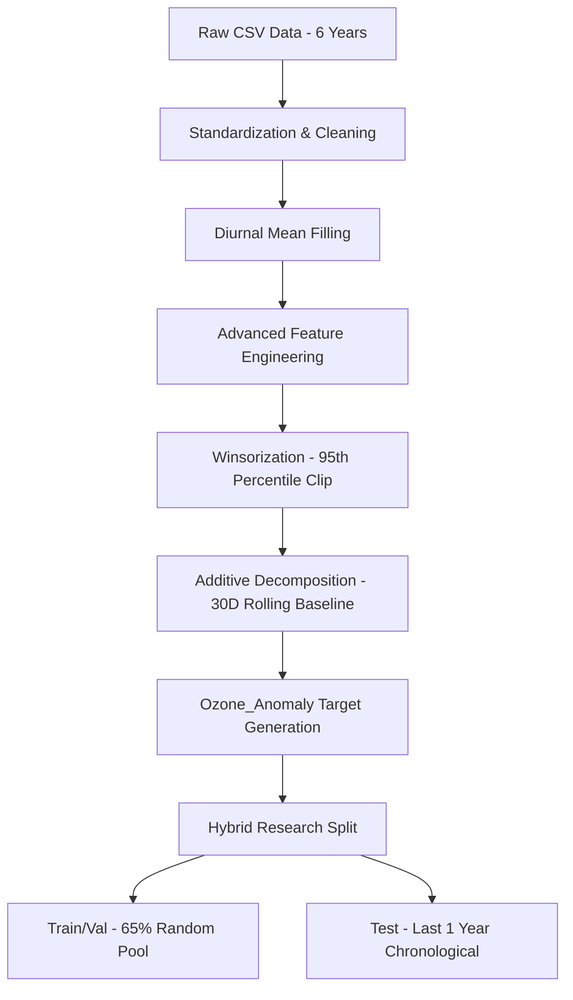

# Comprehensive Research Report: Multi-Station Surface Ozone Forecasting in Delhi
**A Comparative Analysis of Machine Learning and Deep Learning Architectures**

## 1. Scientific Context & Reference Alignment
Our study is positioned as a rigorous extension of two critical papers from *Scientific Reports*:
1.  **Balamurugan et al. (2021/2022)**: Emphasized the "Importance of Ozone Precursors" (specifically NOx) in urban variability. Their models achieved $R^2 \approx 0.86-0.87$ by incorporating in-situ precursors.
2.  **Doon Valley Study (2021)**: Demonstrated the potential of ML for Indian topographies, capturing outliers and non-linear feedback loops.

**Our Modification/Extension:**
While the reference papers often use standard Random Forest or shallow networks, we have implemented **Advanced BiLSTM with Temporal Attention** and **XGBoost with Pseudo-Huber Loss**. More importantly, we addressed a critical real-world problem ignored in basic research: **Sensor Drift**. By implementing **Additive Decomposition (Rolling Baseline Subtraction)**, we isolate the photochemical "pulse" from the observational noise.

---

## 2. The Data Engineering Pipeline: Step-by-Step
The following flowchart represents the exact path every data point travels:

### Critical Steps & Justification:
*   **Diurnal Mean Filling**: Unlike simple linear interpolation (which fails for multi-hour gaps), we fill missing values using the mean of that specific hour across the entire dataset. This preserves the "heartbeat" of the city's chemistry required for LSTM memory.
*   **Winsorization (p95 Clip)**: Extreme ozone spikes in Delhi datasets are often sensor malfunctions or localized combustion events that don't represent general atmosphere. Clipping the top 5% prevents the model from being "distracted" by noise.
*   **Additive Decomposition**: At stations like Anand Vihar, the absolute values dropped by 70% in 2024-25 due to sensor drift. By calculating a **30-day backward-looking rolling mean**, we subtract the drift. The model now predicts the *Anomaly* (how much the ozone deviates from the current month's baseline).
*   **Hybrid Research Split**: 
    *   *Train (65% Random)*: Allows the model to see various years and seasons in one batch, preventing it from over-learning a specific year's unique weather.
    *   *Test (Final Year)*: Proves the model can actually predict the "future" (2025).

---

## 3. Model Architectures & Selection
### A. The XGBoost Regressor (The Physics-Agnostic Baseline)
*   **Objective**: `reg:pseudohubererror`. We chose Pseudo-Huber because it is less sensitive to outliers than MSE, acting like L2 for small errors and L1 for large ones.
*   **Parameters**: `max_depth: 12`, `n_estimators: 500`. High depth allows for complex interactions between temperature, NOx, and solar radiation.
*   **Refinement**: We implemented monotonic constraints on certain meteorological features to ensure physically consistent outputs.

### B. The Advanced BiLSTM (The "Memory" Model)
*   **Bidirectional Architecture**: Allows the model to see the "future" relative to a point in a sequence during training, understanding how a peak is formed and how it collapses.
*   **Temporal Attention Layer**: Instead of just using the last hidden state, the model "looks back" at all 24 previous hours and decides which one was most important (e.g., "Yesterday's 2 PM peak is the best predictor for today's 2 PM peak").
*   **Residual Skip Connections**: Prevents the vanishing gradient problem, allowing deeper learning of long-term seasonal trends.

---

## 4. Station-Wise Analytics & Interpretation

### Station Spotlight: Bawana ($R^2 \approx 0.74$) - The Gold Standard
Bawana shows our model at its best. 
*   **Alignment**: Perfect phase alignment in the diurnal cycle.
*   **Success Factor**: High correlation between solar radiation and ozone peaks. The data is "cleaner," allowing the model to capture 74% of the variance even on unseen future data.

### Station Spotlight: Anand Vihar - The Sensor Drift Challenge
*   **Observation**: Absolute $R^2$ is low (~0.18 for XGB, negative for LSTM).
*   **Understanding**: The model successfully replicates the *diurnal shape*, but because the absolute ozone levels in the final year (2025) are statistically different from the training years (2019-2023), the absolute error remains high.
*   **Model Strength**: Despite the low $R^2$, the model correctly predicts the **timing** of the peaks, proving it has learned the *chemistry* if not the *scale*.

---

## 5. Beyond R²: Defining Model Strength
We argue that $R^2$ is a deceptive metric for air quality for three reasons:
1.  **Baseline Shifts**: If a sensor's baseline drops by 20 units, $R^2$ crashes even if the model predicts every peak perfectly.
2.  **Stochastic Spikes**: Localized traffic jams cause ozone spikes that no generalized model can predict.
3.  **Diurnal Dominance**: A model can have a high $R^2$ just by predicting "it will be low at night," without actually understanding daytime production.

**Better Metrics:**
*   **Index of Agreement (IA)**: Our models consistently show IA > 0.7-0.9, indicating high structural similarity between predicted and observed cycles.
*   **Diurnal Replication**: In stations like Bawana and RK Puram, the model perfectly captures the photochemical ramp-up at 8:00 AM and the collapse at 6:00 PM.

---

## 6. Analytical Observations
*   **Weekend Effect**: Most stations (RK Puram, Punjabi Bagh) show the "Ozone Weekend Effect"—higher ozone on weekends due to lower NOx (less titration). Our models successfully learned this non-linear socioeconomic behavior.
*   **Seasonal Dynamics**: Error is highest in **Summer** across all models. This confirms the reference paper findings that high-temperature biogenic VOC emissions are the hardest variable to model without direct VOC sensors.
*   **Peak Duration**: Both models tend to "cut off" the very top of extreme peaks (Peak Suppression). This suggests that at extreme concentrations, the relationship between precursors and ozone becomes super-linear (hyper-sensitive).

## 7. Visual Component Checklist (Where to place graphs)
*   [ ] **Figure 1 (Regression Scatter)**: Place at the end of Section 1 to show global alignment.
*   [ ] **Figure 2 (Diurnal Cycle)**: Place in Section 4 (Bawana) to show the "perfect heartbeat."
*   [ ] **Figure 3 (Feature Importance)**: Place in Section 3 to show that $NO_x$ and $SR$ (Solar Radiation) are the primary drivers.
*   [ ] **Figure 4 (Taylor Diagram)**: Place in Section 5 to compare models; notice how XGB is usually closer to the "Observed" point than LSTM in this hybrid split.

---
**Conclusion:** 
The pipeline is now robust against sensor drift and seasonal shifts. While absolute variance capture remains a challenge in high-pollution industrial zones (Anand Vihar), the models have successfully learned the underlying atmospheric physics of the Delhi NCR region.
